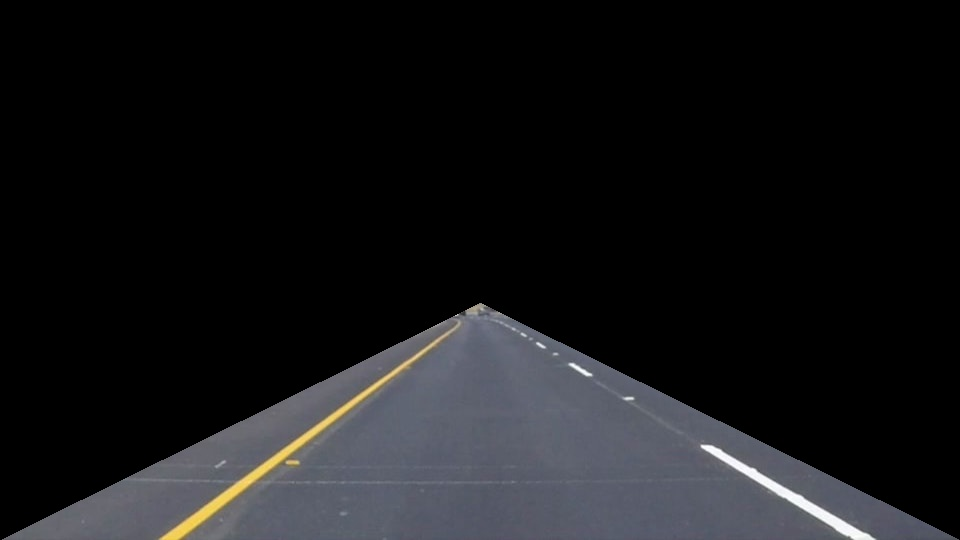
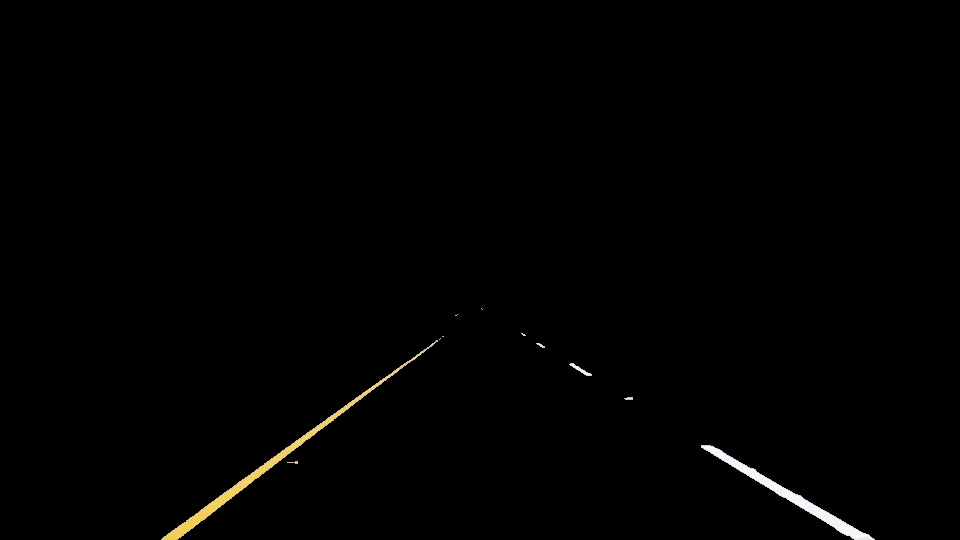
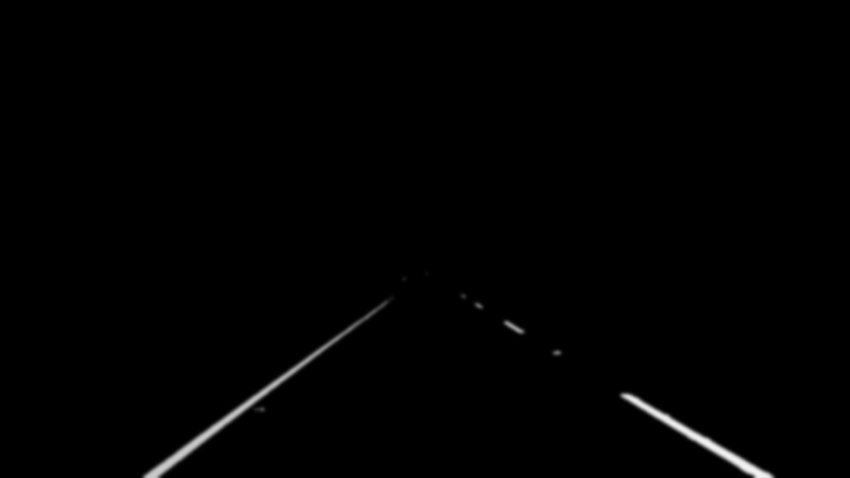
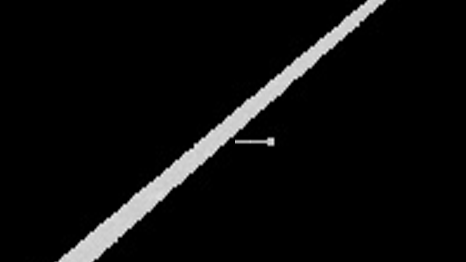
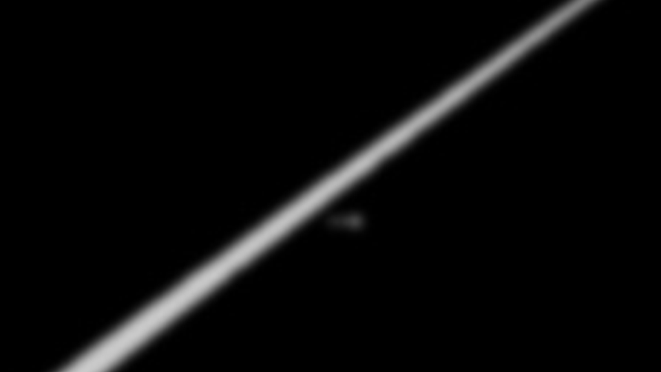
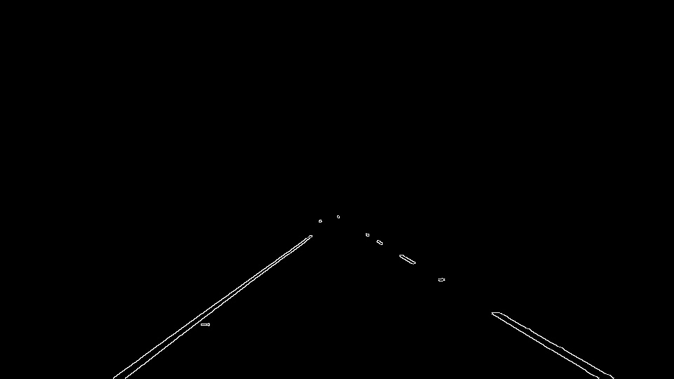
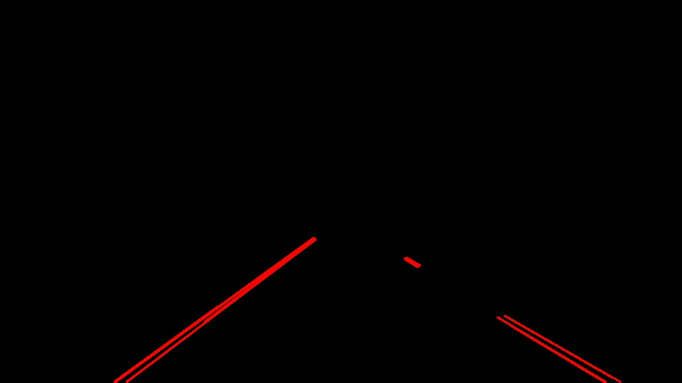
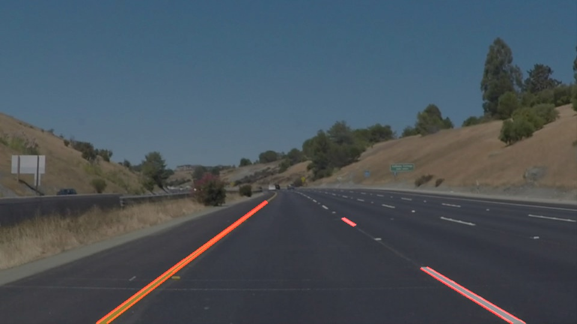
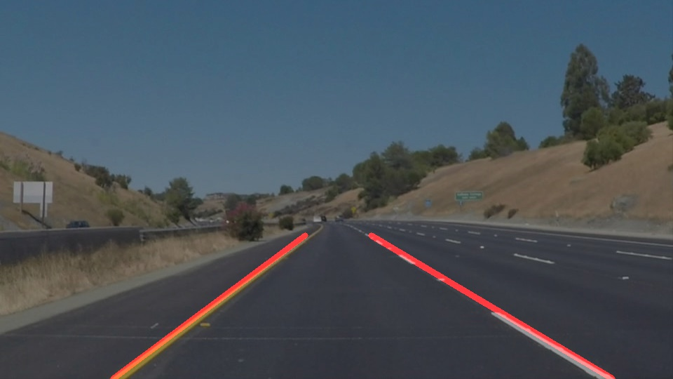
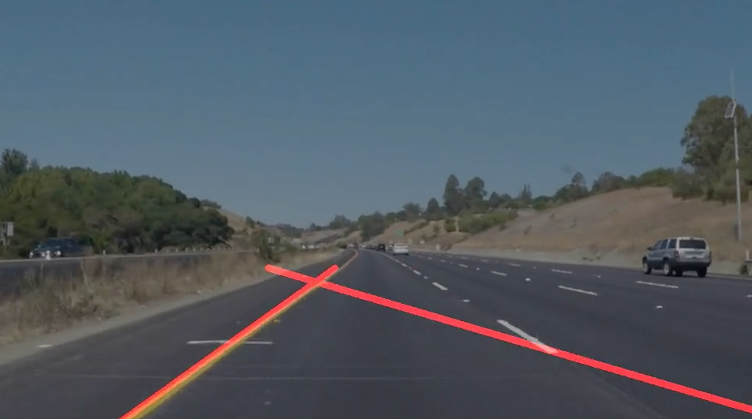

# **Finding Lane Lines on the Road** 

## By: Emile Papillon

---

**Finding Lane Lines on the Road**

Finding lane marking is an essential task in achieving autonomous driving. This article looks at basic computer vision techniques to select relevant pixel in a 2D image. 

The goals / steps of this project are the following:

* Make a pipeline that finds lane lines on a straight road.
* Use Canny edge detection, Hough transform and linear extrapolation to plot lane markings on an image using OpenCV.

---

### 1. Desription of the image processing pipeline. A short explanation of the purpose of each step is provided.

First, using a polygon to extract a region of interest (ROI) will help filtering out some noise. Canny edge detection is not so good at selecting lane markings and it will pick up many straight segments in the image if those are not removed as potential lane marking candidates.

Following this, a color threshold will be used to remove most of the pixels remaining that do not constitute lane marking segments. 

**1. Select a region of interest (ROI) and select pixel using a color threshold.** 

The ROI selection has a major impact on the outcome as the rest of the image contains patterns that could be picked up by the Hough algorithm as lines. However, this is also a potential shortcoming because a fixed ROI may not be suited for all the possible circumstances, such as a curve for example. 

The color filtering also plays a major role. By using a similar approach to the one exposed during class, pixels with yellow or white hues are selected by setting the RGB filter threshold to (180, 180, 0). An obvious shortcoming of this method is that other colors such as the light yellow of faded yellow lane markers will not be picked up. 

**2. Grayscale the image and apply a gaussian blur**

The grayscaling here has limited impact on end result to the extent of my understanding, since we have already applied a color threshold that eliminated most of the pixels that were considered noise. The blurring of the image attenuates some pixel clusters that may have remained and could be interpreted as lines by the Hough transform --- such as the one seen along the left lane marking on the image --  without affecting interesting patterns such as lane markings.

**Before and after gaussian : zoom on left lane in previous image**

The previous image shows a close up of a region that displays a thin line-like pattern that could have been interpreted as a line by the Hough lane detection algorithm.

**3. Apply Canny edges and run Hough on edges**

The Canny edge plays an important role in pattern recognition as it provides a mean to eliminate undesrired patterns by filtering using gradient. The patterns which are less sharp are removed, thus leaving the ones of interest.

Hough was run using the following parameters : 

* Rho  = 1
* Theta = pi/180
* Threshold = 35 
* Min line length = 15
* Max line gaps = 10

Those loose parameters wouldn't have worked it if were not of the efficiency of the previous filtering techniques at removing most of the undesired pixels.  
It was necessary to use such loose settings to pick up the smaller lane markers.
 Otherwise, it would have been very difficult to have more than 1 lane markers on each sides, and this would have had a negative impact on the end result, resulting in less stable lines due to averaging the slope on a smaller sample size.  

**4. Extrapolate lines and apply to original image**

In order to draw a single line on the left and right lanes, I modified the *draw_lines()* function by adding code to calculate the average slope of the right and left lines, then using this average slope I extrapolated the lines to extend them to the maximum and minimum (highest and lowest) points detected on either side. 

The belogning of a given segment to the righ or left side was determined by using the sign of the slope ((y2-y1)/(x2-x1)).

### 2. Identify potential shortcomings with your current pipeline

This pipeline has many obvious shortcommings : 

* Any line pattern on the road that has the following caracteristics will be picked up as a lane marker : 
	* Is white or yellow
	* Falls within the ROI
	* Is linear in shape, does not need to be so long given the loose Hough parameters

 In the second test video displaying a yellow solid lane marking on the left, there is a moment where a random horizontal white painting appears inside the ROI. This is picked up by the Hough algorithm and the averaged slope of the right marking jumps, making the line jerk as displayed in the following image :  

Image showing a white artefact fooling the algorithm into thinking there is an horizontal lane making. This affects the calculated average slope of the right line, making it jerk counterclockwise.

Another shortcoming could be when the road is curved. This pipeline has no capability of making curved line markings.  Moreover, the current code cannot trace curves as it is using an y = m*x + b shape to extrapolate segments.

It is also worth mentioning that I would not get in an autonomous car that uses extrapolation to approximate somethin as critical as lane markings. Better techniques such as machine learning would be better suited to identify the patterns without having to use that much extrapolation.

### 3. Suggest possible improvements to your pipeline

As discussed above, patterns that are similar in shape, color or location to lane markings are easliy picked up in the computation of lane lines. An idea to remove the jerk displayed in the image above would be to compare the slopes of line candidates and remove the ones that are outliers because they have very different slopes. 

Also, we could adjust the ROI depending on the circumstances such as when in a curve. This would require to think of a mechanism to detect curves. To accurately trace lane markings in curves we would need to use a polynomial approximation instead of a line for extrapolation.  

